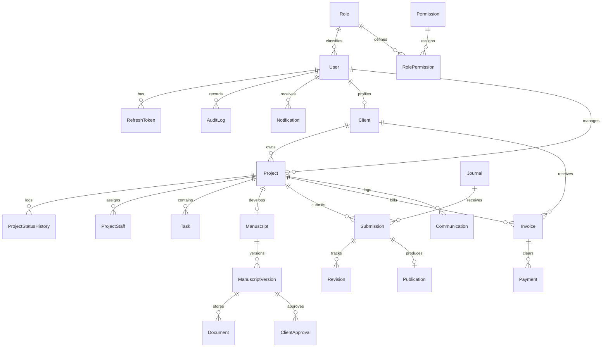

# Scriptara -- Research Publication Management ERP
### Enterprise-Grade Scholarly Publishing & Research Lifecycle Operating System

[](https://opensource.org/licenses/MIT)
[](https://www.typescriptlang.org/)
[](https://nextjs.org/)
[](https://nestjs.com/)
[](https://www.prisma.io/)
[](https://www.postgresql.org/)
[](https://redis.io/)
[](https://turbo.build/)
[](https://www.docker.com/)

---

## Executive Overview

**Scriptara ERP** is an enterprise-grade, full-lifecycle **Research Publication Management System** built for scholarly service organizations, university research offices, and academic consultancies. Engineered with an executive, high-clarity **Light Color Theme** (Royal Indigo/Emerald/Sapphire accents), clean vector SVG iconography (Lucide), and seamless role-based workflows.

Unlike traditional single-journal platforms, Scriptara orchestrates the **entire external research and publication lifecycle**:

```
Researcher Requirement --> Topic Finalization --> Manuscript Drafting --> 10-Point Internal QC
  --> Author Sign-off --> Journal Intelligence Matching --> Portal Submission --> Peer Review / Revisions
  --> Official Acceptance --> Publication Release (DOI) --> Financial Settlement
```

Every project transition, manuscript version, reviewer comment, editorial decision, and billing milestone is recorded in an immutable audit trail with role-based access control (RBAC).

---

## System Architecture

The repository is organized as a high-performance **Turborepo monorepo** with strict boundary separation:

```
scriptara/
|-- docker-compose.yml              # Production container stack (PostgreSQL 16, Redis 7, pgAdmin 4)
|-- start-env.ps1                   # Automated zero-friction Windows startup script
|-- turbo.json                      # Turbo caching and task pipeline
|-- package.json                    # Monorepo workspaces definition
|-- packages/
|   |-- shared/                     # Canonical domain models, enums & state machine definitions
|       |-- src/
|       |   |-- enums/              # 17 ProjectStatus, TaskStatus, ManuscriptStatus, UserRole, etc.
|       |   |-- state-machines/     # Strict status transition matrices and RBAC transition guards
|       |   |-- types/              # Unified pagination, API responses, and metadata types
|       |-- tsconfig.json
|-- apps/
|   |-- backend/                    # Enterprise NestJS 10 REST API
|   |   |-- prisma/
|   |   |   |-- schema.prisma       # 19 Relational models with UUIDs, timestamptz & soft deletes
|   |   |   |-- seed.ts             # Production seeder with 9 roles, real users, journals, and projects
|   |   |-- src/
|   |   |   |-- common/             # RBAC guards, Audit interceptor, Transform & Exception filters
|   |   |   |-- config/             # Type-safe configurations (Postgres, Redis, JWT, CORS)
|   |   |   |-- database/           # Prisma service & transaction manager
|   |   |   |-- modules/
|   |   |   |   |-- auth/           # JWT Access/Refresh tokens with bcrypt & DB revocation
|   |   |   |   |-- users/          # User lifecycle & credential administration
|   |   |   |   |-- clients/        # Institutional client profiles with ORCID & privacy sanitization
|   |   |   |   |-- projects/       # 17-stage state machine engine & automated code generation
|   |   |   |   |-- tasks/          # Kanban tasks with duration tracking & staff assignment
|   |   |   |   |-- manuscripts/    # Non-destructive version tree & 10-point QC checklist
|   |   |   |   |-- documents/      # Multi-tier access storage (INTERNAL, CLIENT, PUBLIC)
|   |   |   |   |-- journals/       # Journal Intelligence DB & auto-matching engine
|   |   |   |   |-- submissions/    # External journal tracker with QC gating
|   |   |   |   |-- publications/   # Published paper registry & DOI resolution
|   |   |   |   |-- finance/        # Invoices, APC disbursements, and payment receipts
|   |   |   |   |-- communications/ # Threaded client & journal correspondence
|   |   |   |   |-- reports/        # Employee scorecards & CSV operational reports
|   |   |   |   |-- audit/          # Cryptographic immutable system audit log
|   |   |   |   |-- dashboard/      # Role-tailored metrics & pipeline analytics
|   |   |   |   |-- notifications/  # Real-time user notification system
|   |   |   |   |-- health/         # Liveness & readiness probes for production
|   |   |   |   |-- automation/     # Event-driven automation engine (see below)
|   |   |   |-- main.ts             # Application bootstrapper with Helmet, validation pipes & Swagger
|   |   |-- package.json
|   |-- frontend/                   # Next.js 14 App Router UI (Executive Light Theme)
|       |-- src/
|       |   |-- app/
|       |   |   |-- globals.css     # Executive light theme design system with premium accents
|       |   |   |-- layout.tsx      # Persistent responsive shell with Sidebar, Navbar & AuthProvider
|       |   |   |-- page.tsx        # Executive Dashboard with throughput statistics
|       |   |   |-- projects/       # Project directory, filter bar & project intake modal
|       |   |   |-- projects/[id]/  # 17-stage visual lifecycle workspace & history tracker
|       |   |   |-- manuscripts/[id]# Manuscript Studio with live markdown editor & outline
|       |   |   |-- qc/             # 10-point QC Workbench with verification criteria
|       |   |   |-- journals/       # Journal Intelligence Database with auto-matching engine
|       |   |   |-- submissions/    # Submission tracker with revision cycle management
|       |   |   |-- publications/   # Published Papers Directory with DOI badges
|       |   |   |-- tasks/          # Interactive Kanban board (TODO, IN_PROGRESS, REVIEW, DONE)
|       |   |   |-- clients/        # Institutional Researcher Directory with ORCID links
|       |   |   |-- finance/        # Invoicing, billing analytics & receipt records
|       |   |   |-- communications/ # Multi-channel communication hub
|       |   |   |-- reports/        # Employee workload scorecards & CSV exports
|       |   |   |-- audit/          # System audit log viewer with request metadata
|       |   |-- components/         # Modular UI components (Navbar, Sidebar, Badges, Modals)
|       |   |-- lib/                # Real API Client, Persona Context & Auth State
|       |-- package.json
```

---

## End-to-End Automation Engine

Scriptara operates as a **fully event-driven ERP** -- human action is only required when a genuine decision must be made. Everything else (status advancement, notifications, task creation, deadline reminders) happens automatically.

### Architecture

```
  Service Layer  --emit event-->  EventEmitter2 (NestJS)
                                       |
                    +------------------+-------------------+
                    |                  |                   |
           Notification        Status Cascade       Auto-Task
           Dispatcher           Listener             Creator
                    |                  |                   |
              Targeted          Project auto-         Stage tasks
              notifications     advances when         created with
              by role           conditions met        due dates
                    
  Cron Scheduler --emit event-->  EventEmitter2
  (Daily at 8/9/10 AM)           (Deadlines, stale projects, overdue tasks)
```

### Core Components

| Component | Location | Purpose |
|:---|:---|:---|
| **Domain Events** | `automation/events/` | 30+ typed event definitions with payload interfaces |
| **Notification Dispatcher** | `automation/listeners/` | Routes events to the correct users based on role and project assignment |
| **Status Cascade Engine** | `automation/listeners/` | Auto-advances project status when downstream conditions are met |
| **Auto-Task Creator** | `automation/listeners/` | Creates stage-appropriate tasks with titles, descriptions, and due dates |
| **Automation Scheduler** | `automation/scheduler/` | Daily cron jobs for deadline alerts, stale project detection, and overdue tracking |

### Status Cascade Rules

When downstream entities change state, the project status advances **automatically** -- no human click required:

| Trigger Event | Condition | Automatic Action |
|:---|:---|:---|
| All assigned tasks completed | Project in `RESEARCH_IN_PROGRESS` | Advance to `DRAFTING` |
| All assigned tasks completed | Project in `DRAFTING` | Advance to `INTERNAL_REVIEW` |
| All assigned tasks completed | Project in `REVISION` | Advance to `INTERNAL_REVIEW` |
| Manuscript QC passed | Project in `INTERNAL_REVIEW` | Advance to `CLIENT_REVIEW` |
| Manuscript sent to client | Project in `INTERNAL_REVIEW` | Advance to `CLIENT_REVIEW` |
| Client approves manuscript | Project in `CLIENT_REVIEW` | Advance to `FINAL_MANUSCRIPT` |
| Client requests revisions | Project in `CLIENT_REVIEW` | Revert to `REVISION` |
| Manuscript QC failed | Project in `INTERNAL_REVIEW` | Revert to `DRAFTING` |
| Manuscript marked submission-ready | Project in `FINAL_MANUSCRIPT` | Advance to `JOURNAL_SELECTION` |
| Journal submission created | Any pre-submission status | Advance to `SUBMITTED` |
| Submission under review | -- | Advance to `UNDER_REVIEW` |
| Journal revision required | -- | Advance to `REVISION_REQUIRED` |
| Submission accepted | -- | Advance to `ACCEPTED` |
| Submission published | -- | Advance to `PUBLISHED` |
| Publication record created | Project in `PUBLISHED` / `ACCEPTED` | Advance to `COMPLETED` |

Every auto-advance is logged in the project's status history with an `[Auto]` prefix for full traceability.

### Automatic Task Creation

When a project enters a new lifecycle stage, the engine auto-creates the standard tasks required at that stage:

| Stage | Auto-Created Tasks |
|:---|:---|
| **Requirement Analysis** | Review client requirements, conduct feasibility assessment, prepare analysis report |
| **Topic Finalization** | Literature review for topic validation, finalize research topic and methodology |
| **Research in Progress** | Conduct primary research, analyze research data, prepare findings summary |
| **Drafting** | Draft Introduction & Literature Review, Methodology & Results, Discussion & Conclusion, format references |
| **Internal QC Review** | Perform 10-point QC verification (auto-assigned to Quality Analyst) |
| **Revision** | Address revision feedback |
| **Journal Selection** | Identify and rank target journals, prepare submission checklist (auto-assigned to Publication Executive) |
| **Revision Required** | Review journal comments, implement revisions, prepare point-by-point response letter |

Each auto-task includes estimated hours, priority level, and a calculated due date. Duplicate tasks are prevented -- if an identical uncompleted task already exists, it is skipped.

### Notification Routing Matrix

Every domain event is routed to the correct stakeholders. Notifications are contextual and human-readable:

| Event | Manager | Client | Staff | Ops Team | Finance |
|:---|:---:|:---:|:---:|:---:|:---:|
| Project created | Assigned | -- | -- | All | -- |
| Project status changed | Yes | Key milestones only | Action stages | -- | -- |
| Staff assigned to project | -- | -- | Assigned user | -- | -- |
| Task assigned | -- | -- | Assignee | -- | -- |
| Task completed | Yes | -- | -- | -- | -- |
| Task overdue | Yes | -- | Assignee | -- | -- |
| Manuscript QC failed | Yes | -- | Author | -- | -- |
| Manuscript QC passed | Yes | -- | -- | -- | -- |
| Manuscript sent to client | -- | Yes | -- | -- | -- |
| Client approved manuscript | Yes | -- | -- | -- | -- |
| Client revision requested | -- | -- | All project staff | -- | -- |
| New manuscript version | Yes | -- | -- | -- | -- |
| Submission created | Yes | Yes | -- | -- | -- |
| Submission accepted | Yes | Yes | -- | -- | -- |
| Submission rejected | Yes | Yes | -- | -- | -- |
| Publication created | Yes | Yes | -- | All | -- |
| Invoice created | -- | Yes | -- | -- | All |
| Payment received | -- | -- | -- | -- | All |
| Deadline approaching | Yes | -- | -- | All | -- |
| Stale project alert | Yes | -- | -- | All | -- |

### Scheduled Automation Jobs

The system runs daily cron jobs to detect time-sensitive conditions:

| Job | Schedule | Detection Logic | Alert Strategy |
|:---|:---|:---|:---|
| **Deadline Alerts** | Daily 8:00 AM | Projects with deadlines 1, 3, or 7 days away; overdue projects | Progressive: weekly re-alerts after deadline passes |
| **Stale Project Detection** | Daily 9:00 AM | Active projects with no updates for 7+ days | Weekly notifications to prevent alert fatigue |
| **Overdue Task Detection** | Daily 8:30 AM | Tasks past their due date that are not completed | Day 1, then weekly reminders |
| **Overdue Invoice Detection** | Daily 10:00 AM | Invoices past due date still in PENDING/SENT status | Alerts at day 1, 7, 14, and 30 |

---

## The 17-Stage Project Lifecycle

Scriptara models scholarly publication through 17 explicit operational states enforced by a backend state machine:

| Stage # | Canonical State Key | Stage Name | Description & Action Gate |
|:---:|:---|:---|:---|
| **01** | `NEW_REQUIREMENT` | New Requirement | Intake of client scope, domain, target index, and deadline. |
| **02** | `REQUIREMENT_ANALYSIS` | Requirement Analysis | Feasibility study, literature pre-screening, and resource allocation. |
| **03** | `TOPIC_FINALIZATION` | Topic Finalization | Novelty verification and formal title formulation. |
| **04** | `RESEARCH_IN_PROGRESS` | Research in Progress | Experimental benchwork, dataset collation, and mathematical proofs. |
| **05** | `DRAFTING` | Manuscript Drafting | Initial manuscript drafting across all IMRAD sections. |
| **06** | `INTERNAL_REVIEW` | Internal QC Review | **Mandatory 10-Point QC Gate** (Plagiarism, citations, formatting). |
| **07** | `CLIENT_REVIEW` | Client / Author Review | Dispatched to corresponding author for technical review. |
| **08** | `REVISION` | Author Revision | Incorporating client feedback and refining manuscript versions. |
| **09** | `FINAL_MANUSCRIPT` | Final Manuscript Approved | Formal author sign-off; manuscript frozen for external submission. |
| **10** | `JOURNAL_SELECTION` | Journal Selection | Journal Intelligence matching based on scope, APC, and indexing. |
| **11** | `SUBMISSION_PENDING` | Submission Pending | Cover letter drafting, formatting checks, and file packaging. |
| **12** | `SUBMITTED` | Submitted to Journal | Uploaded to ScholarOne, Editorial Manager, or publisher portal. |
| **13** | `UNDER_REVIEW` | Under Peer Review | Tracking editorial status, reviewer assignment, and timelines. |
| **14** | `REVISION_REQUIRED` | Revision Required | Processing Major/Minor revisions with response-to-reviewers doc. |
| **15** | `ACCEPTED` | Accepted for Publication | Official editorial acceptance letter received; APC processed. |
| **16** | `PUBLISHED` | Published with DOI | Final online publication; DOI recorded and certificate issued. |
| **17** | `COMPLETED` | Project Completed | Project archived, final invoices cleared, and closure confirmed. |

Universal control transitions allow authorized managers to place projects `ON_HOLD` or `CANCELLED` at any non-terminal stage.

---

## 9 Granular Role Personas (RBAC Matrix)

The system features real-time role switching for evaluating all 9 operational perspectives. All accounts are pre-seeded with the universal password: **`Password123!`**:

| Persona | Name | Seed Email | Access Scope & Responsibilities |
|:---|:---|:---|:---|
| **Super Admin** | Alex Vance | `admin@scriptara.com` | Full system governance, role permissions, system configuration. |
| **Operations Manager** | David Mercer | `david.m@scriptara.com` | Organization-wide project throughput, deadlines, and staff allocation. |
| **Research Manager** | Elena Rostova | `elena.r@scriptara.com` | Topic validation, research methodology, team oversight, status approvals. |
| **Research Staff** | Dr. Sarah Chen | `sarah.c@scriptara.com` | Manuscript drafting, version creation, benchmark experiments, assigned tasks. |
| **Quality Analyst (QC)** | Marcus Vance | `marcus.v@scriptara.com` | 10-point QC gate verification, similarity scoring, formatting checks. |
| **Publication Executive** | Priya Sharma | `priya.s@scriptara.com` | Journal identification, submission portals, editorial correspondence. |
| **Client / Author** | Dr. John Reynolds | `reynolds@stanford.edu` | Scope submission, manuscript approvals, download final papers & certificates. *(Internal staff notes and private journal communications strictly sanitized)*. |
| **Finance & Accounts** | Sophie Taylor | `sophie.t@scriptara.com` | Invoices, payment receipts, APC disbursements, and financial analytics. |
| **Executive Management** | Robert Stirling | `robert.s@scriptara.com` | Business intelligence, employee scorecards, and revenue reporting. |

---

## Mandatory 10-Point Internal QC Gate

To guarantee publication success in Q1/Q2 high-impact journals, Scriptara enforces a strict **10-Point Technical Verification Gate**. External submission is blocked by backend middleware until all 10 criteria pass:

```
[x] 1. Title & Scope Alignment      -> Concise, scientifically accurate, avoiding broad claims
[x] 2. Abstract & Keywords           -> Word count <= 250 words; MeSH/IEEE canonical indexing
[x] 3. Research Problem & Gap        -> Identified literature gap explicitly framed
[x] 4. Methodology & Rigor           -> Equations, algorithms, and experimental steps reproducible
[x] 5. Experimental Datasets         -> Data provenance, benchmarks (e.g. ClinVar, ImageNet) verified
[x] 6. Citation & DOI Integrity      -> >= 80% peer-reviewed citations with resolvable DOIs
[x] 7. Journal Formatting Match      -> Exact margins, columns, reference styles (Nature, IEEE, etc.)
[x] 8. Plagiarism Similarity Check   -> Verified < 10% overall similarity (< 1% per single source)
[x] 9. Author Declarations           -> Conflicts of interest, funding disclosures, IRB approvals
[x] 10. Institutional & ORCID Creds  -> Verified institutional email and authenticated ORCID iDs
```

---

## Relational Data Model (19 Prisma Entities)



---

## Event-Driven Domain Events (Full Catalog)

Every mutation in the system emits a typed domain event, enabling reactive automation:

| Event Category | Event Name | Payload |
|:---|:---|:---|
| **Project** | `project.created` | projectId, projectCode, title, clientId, creatorId, managerId, priority |
| **Project** | `project.status.changed` | projectId, fromStatus, toStatus, changedBy, note, clientId |
| **Project** | `project.staff.assigned` | projectId, userId, role, assignedBy |
| **Project** | `project.deadline.approaching` | projectId, deadline, daysRemaining |
| **Project** | `project.stale` | projectId, status, daysSinceUpdate |
| **Task** | `task.created` | taskId, projectId, title, assigneeId, dueDate |
| **Task** | `task.status.changed` | taskId, fromStatus, toStatus, assigneeId, completionPct |
| **Task** | `task.assigned` | taskId, assigneeId, assignedBy |
| **Task** | `task.overdue` | taskId, dueDate, daysOverdue |
| **Task** | `task.all.completed` | projectId, totalTasks |
| **Manuscript** | `manuscript.created` | manuscriptId, projectId, title, authorId |
| **Manuscript** | `manuscript.version.created` | versionId, versionNumber, authorId |
| **Manuscript** | `manuscript.status.changed` | versionId, fromStatus, toStatus, changedBy |
| **Submission** | `submission.created` | submissionId, journalId, journalName |
| **Submission** | `submission.status.changed` | submissionId, fromStatus, toStatus, journalName |
| **Publication** | `publication.created` | publicationId, title, doi, journalName |
| **Finance** | `invoice.created` | invoiceId, invoiceNumber, amount, dueDate |
| **Finance** | `invoice.overdue` | invoiceId, daysOverdue |
| **Finance** | `payment.received` | paymentId, invoiceId, amount |

---

## Live Cloud Publishing (Vercel + Render)

Scriptara ERP is engineered for seamless cloud deployment:
- **Frontend**: One-click deploy on [Vercel](https://vercel.com).
- **Backend & Database**: One-click deploy on [Render](https://render.com) using the included Infrastructure-as-Code blueprint (`render.yaml`).

For step-by-step instructions with environment variables, read the **[Production Publishing Guide](DEPLOYMENT_GUIDE.md)**.

---

## Local Quickstart & Development Guide

### System Requirements
- **Node.js**: >= 20.0.0
- **npm**: >= 10.0.0
- **Docker & Docker Desktop** (Windows / macOS / Linux)

### Option A: Automated One-Click Launch (Windows PowerShell)
The repository includes an automated orchestration script that checks Docker, spins up containers, runs database migrations, seeds real records, and launches both frontend and backend:

```powershell
.\start-env.ps1
```

---

### Option B: Step-by-Step Manual Setup

#### 1. Clone & Install Dependencies
```bash
git clone https://github.com/Manju1303/research-erp.git
cd scriptara
npm install
```

#### 2. Start PostgreSQL & Redis Containers
```bash
docker compose up -d
```
*Verifies PostgreSQL running on port `5432`, Redis on `6379`, and pgAdmin on `5050`.*

#### 3. Configure Environment Variables
Copy the example environments:
```bash
cp apps/backend/.env.example apps/backend/.env
cp apps/frontend/.env.example apps/frontend/.env.local
```

#### 4. Run Prisma Migrations & Seed Real Data
```bash
# Generate the Prisma Client
npx prisma generate --schema=apps/backend/prisma/schema.prisma

# Push schema migrations to PostgreSQL
npx prisma migrate dev --name init --schema=apps/backend/prisma/schema.prisma

# Populate 9 real roles, verified journals, projects, QC checklists & invoices
npm run db:seed --prefix apps/backend
```

#### 5. Launch Full Stack
```bash
npm run dev
```

The system will start with:
- **Frontend App**: [http://localhost:3000](http://localhost:3000)
- **Backend API**: [http://localhost:4000/api/v1](http://localhost:4000/api/v1)
- **Interactive Swagger Docs**: [http://localhost:4000/api/docs](http://localhost:4000/api/docs)
- **pgAdmin Database Console**: [http://localhost:5050](http://localhost:5050) *(User: `admin@scriptara.local`, Pass: `pgadmin_dev_pass`)*

---

## REST API Reference

The backend provides complete OpenAPI / Swagger documentation at `/api/docs`. Key endpoints include:

| Module | Method | Endpoint | Description | Guard / RBAC |
|:---|:---:|:---|:---|:---|
| **Auth** | `POST` | `/api/v1/auth/login` | Authenticate with email/password; returns JWT pair | Public |
| **Auth** | `POST` | `/api/v1/auth/refresh` | Refresh access token using active refresh token | Public |
| **Auth** | `GET` | `/api/v1/auth/me` | Fetch authenticated user profile & permissions | JWT Bearer |
| **Projects** | `GET` | `/api/v1/projects` | List projects with filtering, pagination & search | `projects:read` |
| **Projects** | `POST` | `/api/v1/projects` | Create new research project with unique code | `projects:create` |
| **Projects** | `PATCH`| `/api/v1/projects/:id/status` | Execute state machine lifecycle transition | `projects:transition_status` |
| **Manuscripts**| `POST`| `/api/v1/manuscripts/:id/versions` | Create non-destructive manuscript revision | `manuscripts:create` |
| **QC Gate** | `PATCH`| `/api/v1/manuscripts/versions/:id/qc`| Update 10-point verification checklist items | `manuscripts:qc_update` |
| **Journals** | `GET` | `/api/v1/journals` | Search journal intelligence database | Public / Auth |
| **Journals** | `POST`| `/api/v1/journals/match` | Match paper against journals by scope & APC | Auth |
| **Submissions**| `POST`| `/api/v1/submissions` | Register portal submission with QC gate check | `manuscripts:read` |
| **Tasks** | `GET` | `/api/v1/tasks` | Get project tasks formatted for Kanban view | `tasks:read` |
| **Tasks** | `PATCH`| `/api/v1/tasks/:id/status` | Update task status & completion percentage | `tasks:update` |
| **Finance** | `GET` | `/api/v1/finance/invoices` | List invoices with payment reconciliation | `finance:read` |
| **Notifications** | `GET` | `/api/v1/notifications` | Fetch user notifications with unread count | JWT Bearer |
| **Notifications** | `PATCH` | `/api/v1/notifications/:id/read` | Mark notification as read | JWT Bearer |
| **Health** | `GET` | `/health` | Liveness probe for load balancers | Public |
| **Health** | `GET` | `/health/ready` | Readiness probe (checks DB + Redis connectivity) | Public |
| **Audit** | `GET` | `/api/v1/audit-logs` | Immutable audit trail for compliance verification | `audit_logs:read` |

---

## Security & Data Governance

1. **Authentication & Token Storage**:
   - Access tokens signed with HMAC-SHA256 (`900s` TTL).
   - Refresh tokens hashed with `bcrypt` (12 rounds) and stored in the database for instant session revocation on logout.
2. **Strict Client Data Sanitization**:
   - Internal staff discussions, quality analyst remarks, and vendor notes are stripped via DTO serialization filters before serving client accounts.
3. **Automated Audit Interceptor**:
   - Every mutating HTTP request (`POST`, `PUT`, `PATCH`, `DELETE`) is captured asynchronously by `AuditInterceptor`, recording user identity, role, IP address, user agent, action target, and duration.
4. **Input Sanitization & Validation**:
   - Global NestJS `ValidationPipe` with `whitelist: true` and `forbidNonWhitelisted: true` preventing parameter injection attacks.
5. **Rate Limiting**:
   - Three-tier `ThrottlerModule` guard (10 req/sec, 50 req/10s, 200 req/min) applied globally to prevent brute-force and DDoS attacks.
6. **Security Headers**:
   - `Helmet` middleware sets strict HTTP security headers (CSP, X-Frame-Options, HSTS, etc.) on all responses.

---

## Technology Stack

| Layer | Technology | Version | Purpose |
|:---|:---|:---|:---|
| **Frontend** | Next.js (App Router) | 14.x | Server-rendered React UI with file-based routing |
| **Styling** | CSS Variables + Lucide Icons | -- | Executive light theme with premium accents |
| **Backend** | NestJS | 10.4 | Enterprise-grade Node.js framework with DI and modules |
| **ORM** | Prisma | 5.22 | Type-safe database client with migration management |
| **Database** | PostgreSQL | 16 Alpine | Production relational database with JSONB and full-text search |
| **Cache / Queues** | Redis | 7 Alpine | Session cache, rate limiting, and BullMQ job queue backing |
| **Event Bus** | @nestjs/event-emitter | 2.x | In-process event-driven automation engine |
| **Scheduler** | @nestjs/schedule | 4.x | Cron-based deadline alerts and stale project detection |
| **Auth** | Passport + JWT | -- | Stateless token authentication with refresh rotation |
| **Monorepo** | Turborepo | -- | Parallel builds, caching, and workspace management |
| **Containers** | Docker Compose | -- | Local development stack (Postgres, Redis, pgAdmin) |
| **API Docs** | Swagger / OpenAPI | -- | Auto-generated interactive API documentation |

---

## Build & Quality Verification

To run static type checks and builds across all packages:

```bash
# Verify shared contracts
npx tsc -p packages/shared/tsconfig.json --noEmit

# Verify backend NestJS compilation
npx tsc -p apps/backend/tsconfig.json --noEmit
npm run build --prefix apps/backend

# Verify frontend Next.js 14 production build (15 static/dynamic routes)
npm run build --prefix apps/frontend
```

---

## License
This project is licensed under the **MIT License**.
Distributed by **Scriptara Technologies**.
